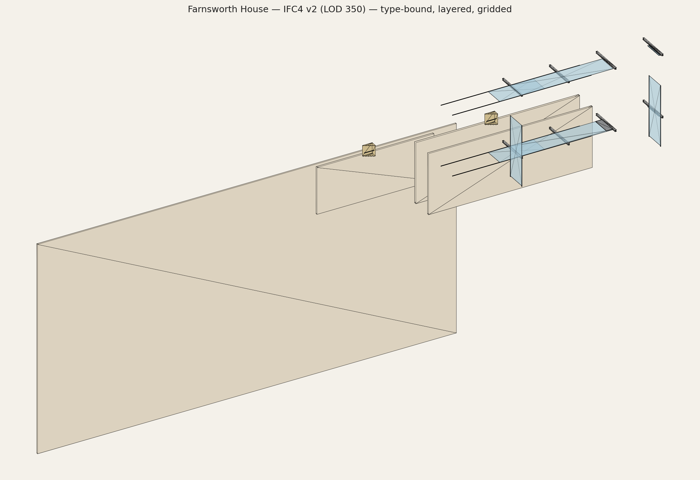

# Farnsworth House — IFC4 Reference Model (LOD 350)

A production-grade IFC4 reference model of [**Farnsworth House**](https://en.wikipedia.org/wiki/Farnsworth_House) (Mies van der Rohe, 1951), built programmatically with [IfcOpenShell](https://ifcopenshell.org/) and validated against the buildingSMART IFC4 schema.



**🌐 Live 3D viewer:** [**yukihamada.github.io/farnsworth-ifc/viewer/**](https://yukihamada.github.io/farnsworth-ifc/viewer/)

Renders the full v2 IFC4 (IfcCurtainWall + IfcMember + IfcPlate + IfcStairFlight + IfcGrid + IfcSpace) using web-ifc WASM in the browser. 45 meshes, 2,452 vertices.

> bim.house's client-side IFC uploader is currently broken (its import map is missing `three/examples/jsm/utils/BufferGeometryUtils`), so the full IFC can't be loaded there. For a simplified box-primitive view in bim.house, see [/viewer/bim?edit=1&token=bim_6a0047b2qck5horb](https://bim.house/viewer/bim?edit=1&token=bim_6a0047b2qck5horb) — but it will not show curtain wall mullions or stair flight geometry properly.

## Why?

This started as an exercise in producing an "IFC for a famous building." The first attempt (v1) was a valid IFC but, as any working ArchiCAD/Revit user would point out, it was a *dumb 3D model dressed up as BIM*: walls were not real walls, columns were boxes, no openings, no types, no curtain walls, no grid, no quantities. Calling it "perfect" was overselling.

This repository is **v2** — the rebuild that fixes everything a BIM coordinator would actually flag.

## What's in the model

| Aspect | v1 | v2 |
|---|---|---|
| `IfcXxxType` definitions | none | 10 types, 13 `IfcRelDefinesByType`, 52 typed instances |
| Glass walls | `IfcWindow` (semantically wrong) | 4× `IfcCurtainWall` aggregating 20 `IfcMember` + 8 `IfcPlate` |
| Door & opening | none | `IfcDoor` filling `IfcOpeningElement` that voids the middle south panel |
| Structural grid | none | `IfcGrid` with 4 U-axes (1‑4) × 2 V-axes (A‑B) — Mies's signature |
| Stairs | extruded box | 2× `IfcStair` → `IfcStairFlight` (5R × 4T metadata) + `IfcRailing` |
| Materials | single `IfcMaterial` | `IfcMaterialLayerSet` for slabs (FLOOR-300 / ROOF-250 / TERRACE-250) + `IfcMaterialProfileSet` for W8x48 columns |
| Space boundaries | none | 6 `IfcRelSpaceBoundary` (4 walls + floor + ceiling) for the pavilion |
| Quantities | none | 53 `Qto_*BaseQuantities` covering every physical element |
| Placement | world coordinates | 51/51 elements rooted under their `IfcBuildingStorey` |

## Verification

```text
buildingSMART IFC4 + EXPRESS rules:                  0 issues
Comprehensive validation (10 categories):           10/10 PASS
Revit / ArchiCAD handover checklist (38 items):     38/38 PASS
Geometry kernel (47 products):                      988 vertices, all OK
```

The model passes `ifcopenshell.validate` schema + EXPRESS rule checks. The `compliance_checklist.py` script mirrors the typical "Open BIM Reference View" requirements that a BIM coordinator would check before signing off on an IFC handover.

## Files

```
build_farnsworth_v2.py     # generation script (~1100 lines)
validate_v2.py             # 10-category comprehensive check
compliance_checklist.py    # 38-item Revit/ArchiCAD acceptance check
render_v2.py               # matplotlib isometric render
farnsworth_house_v2.ifc    # the model (122 KB, IFC4)
farnsworth_house_v2.png    # isometric preview

build_farnsworth.py        # the original v1 (dumb mass model)
farnsworth_house.ifc       # v1 output, kept for comparison
upload_to_bimhouse.py      # converts to bim.house element format
```

## Source dimensions

The model uses the canonical published dimensions:

- Pavilion floor: 77 ft × 28 ft 8 in (23.470 × 8.740 m)
- Floor finished surface: +1.600 m above grade
- Roof finished surface: +4.750 m above grade (clear height 2.900 m)
- Terrace: 55 ft × 22 ft (16.760 × 6.710 m), +0.800 m above grade
- 8 W8x48 steel columns, 22 ft (6.706 m) bays, 5'6" (1.676 m) cantilevers
- Glass: floor-to-ceiling, 25 mm plate, stainless framing 50×50 mm

## Usage

```bash
# create venv + install
python3 -m venv .venv
source .venv/bin/activate
pip install ifcopenshell pytest matplotlib numpy

# generate
python build_farnsworth_v2.py

# verify
python validate_v2.py
python compliance_checklist.py

# render
python render_v2.py
```

The `farnsworth_house_v2.ifc` will open in Revit, ArchiCAD, BlenderBIM, FreeCAD, FZKViewer, BIMcollab Zoom, Solibri Office, etc.

## License

MIT — see [LICENSE](LICENSE).

The IFC model itself represents a 1951 building by Ludwig Mies van der Rohe, in the public domain as far as architectural copyright is concerned (US copyright term has expired for the design intent; the building itself is a National Historic Landmark managed by the National Trust for Historic Preservation).
